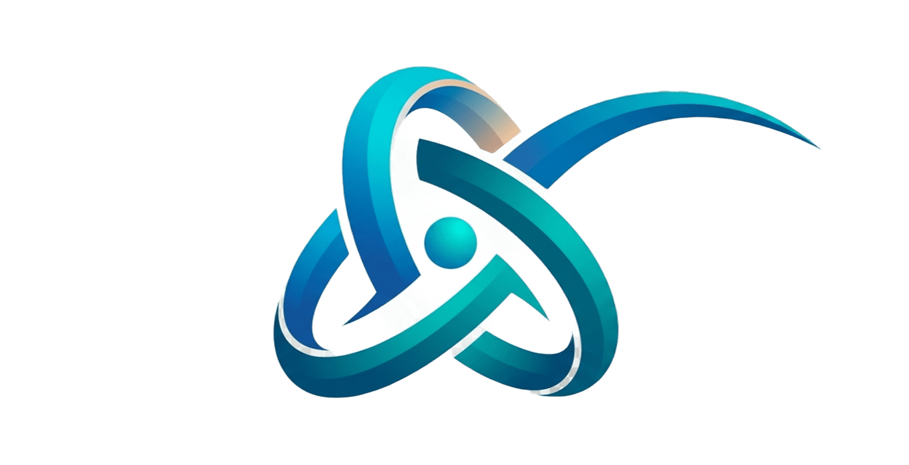

## Hi there 👋
# 🚀 Hola, soy Dimas | Software Engineer Student

  

---

### ⚡ Sobre mí
Estudiante de **Ingeniería de Software** enfocado en el desarrollo de aplicaciones para **Mobile & Desktop** de alto rendimiento, sistemas distribuidos y arquitecturas resilientes. Constantemente investigando sobre sistemas embebidos, topologías de red y sincronización de datos en entornos desconectados.

* 💻 **Desktop & Mobile**: Especializado en **Flutter & Dart** para software multiplataforma de producción (Windows, Linux y Mobile).
* 🔄 **Arquitecturas Offline-First**: Diseño e implementación de motores de persistencia local reactiva (**SQLite / Drift**) con sincronización delta bidireccional hacia la nube (**Supabase / PostgreSQL**).
* 🌐 **Sistemas Distribuidos**: Explorando topologías de red, sincronización idempotente entre nodos, sistemas embebidos y tolerancia a fallos.
* 🎓 **Formación**: Estudiante de Ingeniería de Software en la Universidad Alejandro de Humboldt.
* 🚀 **Filosofía**: Aprendiendo cosas nuevas, investigando arquitectura y construyendo código real todos los días.

---

### 🛠️ Stack Tecnológico

#### 📱 Desktop & Mobile

  
  
  

#### 🔄 Persistencia Local & Offline-First

  
  
  

#### ☁️ Backend, Cloud & Bases de Datos

  
  
  
  

#### 🌐 Web & Frontend

  
  
  
  

#### ⚙️ Herramientas & Entornos

  
  
  
  

---

### 🚀 Proyectos Destacados (Arquitectura Offline-First & Sistemas Reales)

<table>
  <tr>
    <td width="90" align="center" valign="top">
      
    </td>
    <td>
      <h4>⚽ Ecosistema Don Bosco (Escuela & Torneos)</h4>
      

        Suite integral multiplataforma (Desktop Windows/Linux) para control escolar, gestión de atletas, recaudación bimonetaria y arbitraje. Diseñado para operar en ventanilla sin interrupciones con sincronización transparente a la nube.
      

      

        
        
        
        
        
        
      

      <ul>
        <li><b>Arquitectura Offline-First:</b> Operación de caja 100% autónoma en SQLite local (Drift) sin dependencia de internet, con sincronización delta reactiva a Supabase.</li>
        <li><b>Auditoría & Seguridad Cloud:</b> Base de datos PostgreSQL 17 auditada con 76 políticas de Row Level Security (RLS) granulares (0 advertencias en Supabase Advisor), bitácora inmutable de auditoría (<code>audit_logs</code>) y réplica local 1:1 en Docker.</li>
        <li><b>Confiabilidad Probada:</b> 440 pruebas automatizadas (100% pass) con simulaciones de estrés de 120 días y resiliencia ante caídas de red.</li>
      </ul>
      

        <code>Flutter 3.44</code> • <code>Dart 3.12</code> • <code>Drift / SQLite</code> • <code>Supabase (PG 17)</code> • <code>Docker</code>
      

    </td>
  </tr>
  <tr>
    <td width="90" align="center" valign="top">
      
    </td>
    <td>
      <h4>⚡ Axis ERP / AxisSuite</h4>
      

        Plataforma SaaS Offline-First para gestión empresarial y puntos de venta (POS) multi-tenant con sincronización jerárquica en tiempo real.
      

      <ul>
        <li><b>Sincronización Bidireccional Jerárquica:</b> Motor SyncService con resolución de conflictos por niveles para catálogos, existencias y ventas.</li>
        <li><b>Multi-Tenant Local:</b> Particionamiento seguro de datos en base local SQLite y replicación aislada por negocio en Supabase.</li>
        <li><b>Alta Disponibilidad:</b> POS con búsqueda instantánea indexada y operación continua en escenarios de conectividad nula o intermitente.</li>
      </ul>
      

        <code>Flutter</code> • <code>Dart</code> • <code>Drift</code> • <code>Supabase</code> • <code>SaaS Multi-Tenant</code>
      

    </td>
  </tr>
</table>

---

### 📊 Métricas & Actividad en GitHub

  
  

  

---

### 📫 Conéctate conmigo

  
  

